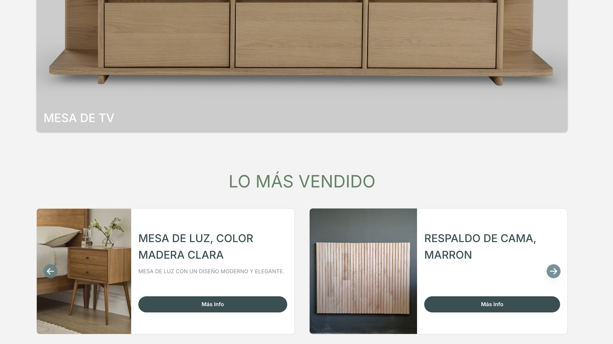

# E-Commerce Furniture App for K'óoben (WIP)

This app is a work-in-progress (WIP) for what will become an e-commerce platform for selling furniture for the Argentine store **K'óoben**. It's built with **Next.js** and **TypeScript**, and integrates the following technologies:

- **Clerk** for authentication
- **Mantine** for UI components and styling
- **Axios** for handling HTTP requests
- **TanStack Query** for efficient data fetching and state management
- A custom error handling system for managing API and server errors.

## Screenshots

Here are some preview images from the current development:

### Home Page



### Catalog


## Features

- Built with Mantine for modern UI components and styling
- Authentication via Clerk
- Modern front-end development using Next.js
- Integrated with external APIs using Axios
- State management and data fetching handled by TanStack Query
- A dedicated file for handling errors efficiently throughout the app.
- Code quality and security enhanced with [**Amazon CodeGuru**](https://aws.amazon.com/codeguru/) for automated code reviews and vulnerability detection.

## Development Practices

### Branch Protection

This repository uses GitHub's branch protection rules to safeguard the main branch from accidental deletions and force pushes. The protection is configured using [GitHub Rulesets](https://docs.github.com/en/repositories/configuring-branches-and-merges-in-your-repository/managing-rulesets/about-rulesets).

### Secret Scanning with 🐷🔑🐷 TruffleHog

This project uses TruffleHog for detecting and preventing secrets from being committed to the repository. TruffleHog scans the entire git history for secrets and credentials.

You can run TruffleHog locally with these commands:

```bash
# Scan the local repository
trufflehog git file://./kooben-fe

# Scan the remote repository
trufflehog git https://github.com/thusspokedata/kooben-fe
```

## Backend

The backend for this application is developed with **NestJS**. You can check out the repository [here](https://github.com/thusspokedata/kooben-be).

## Design Reference

For design details, you can visit the K'óoben design on [Figma](https://www.figma.com/design/5pfsdvCtVxXvwbVdgRdLEB/kooben?node-id=0-1&node-type=canvas&t=KQT7fgUIFiAWpKjl-0).


Stay tuned for further updates!
